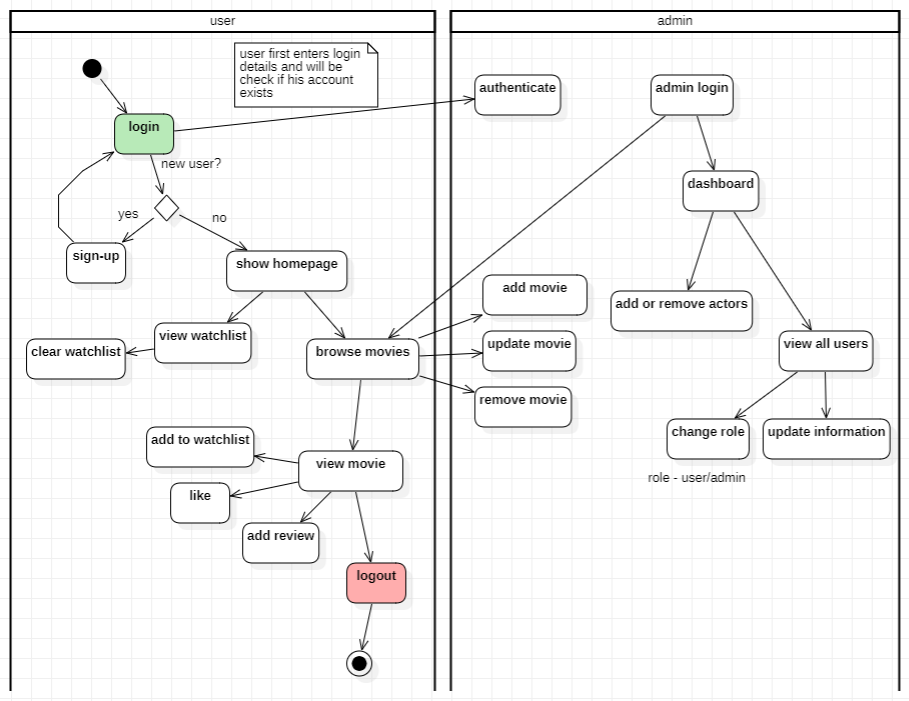

# Movie Review System

> It's a web based **Movie Review Application** where users will be able to write reviews on movies.

## Project Report

- [Final Report](./docs/ooadj-project-report.pdf)

## Design Diagrams

- Use Case Diagram

  

- Activity diagram

  

- State diagram

  

- Class diagram

  

## Contributors

- Kushagra Singh - **PES1UG20CS657**
- Nikhil Raju Mohite - **PES1UG20CS667**
- Pavan Kumar Nuthi - **PES1UG20CS670**
- Pranav R - **PES1UG20CS673**

## Dependency

– If you want to use PostgreSQL:

```xml
<dependency>
  <groupId>org.postgresql</groupId>
  <artifactId>postgresql</artifactId>
  <scope>runtime</scope>
</dependency>
```

- If you want to use MySQL with MariaDB driver

```xml
<dependency>
	<groupId>org.mariadb.jdbc</groupId>
	<artifactId>mariadb-java-client</artifactId>
	<scope>runtime</scope>
</dependency>
```

- For Thymeleaf template engine

```xml
<dependency>
	<groupId>org.springframework.boot</groupId>
	<artifactId>spring-boot-starter-thymeleaf</artifactId>
</dependency>
```

## Configure Spring Datasource, JPA, App properties

Open `src/main/resources/application.properties`

- For PostgreSQL:

```
spring.datasource.url= jdbc:postgresql://localhost:5432/dsi
spring.datasource.username= postgres
spring.datasource.password= root

spring.jpa.properties.hibernate.dialect= org.hibernate.dialect.PostgreSQLDialect
```

- For MySQL

```
spring.datasource.url= jdbc:mysql://localhost:3306/dsi
spring.datasource.username= root
spring.datasource.password=

spring.datasource.driver-class-name=org.mariadb.jdbc.Driver
```

# Hibernate ddl auto (create, create-drop, validate, update)

```
spring.jpa.hibernate.ddl-auto= update
```

## Run Spring Boot application

```
mvn spring-boot:run
```

## Follow the below steps for postgres

```
1. First install postgresql via apache xampp
2. Postgesql  default usename is : postgres
3. Postgresql database password should be : root
4. Create a database named `dsi`
5. Run the code, that will create all tables in `dsi` database.
6. Then signin as an admin using username `admin` and password `admin` similarly for `user`, `editor` and `creator`
```

## Follow the below steps for MySQL

```
1. First install xampp and start mysql server
2. mysql  default usename is : root
3. Postgresql database password should be :
4. Create a database named `dsi`
5. Run the code, that will create all tables in `dsi` database.
6. Then signin as an admin using username `admin` and password `admin` similarly for `user`, `editor` and `creator`
```
